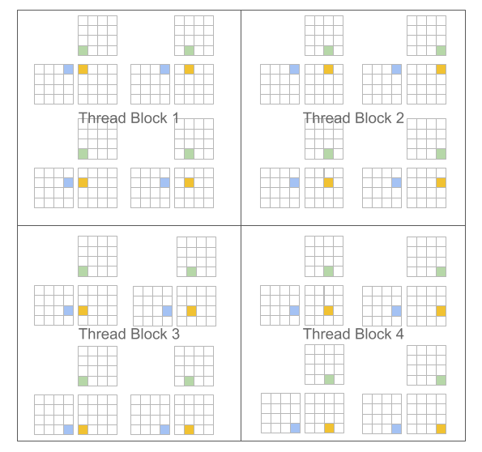
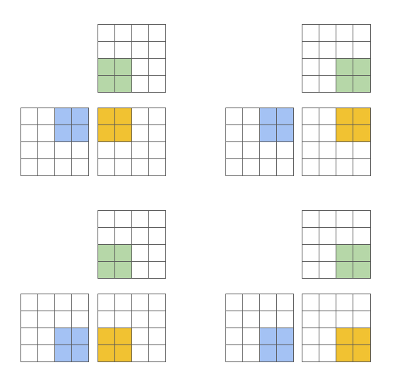

============
简介
============

-----------
背景动机
-----------

过去十年间，深度神经网络（DNN）已成为机器学习（ML）领域的重要模型，在自然语言处理 [SUTSKEVER2014]_、计算机视觉 [REDMON2016]_、计算神经科学 [LEE2017]_ 等众多领域取得了最先进的性能。这类模型的优势在于其层次化结构，由一系列参数化层（如卷积层）和非参数化层（如线性整流函数）组合而成。这一模式虽然计算量极大，却能产生大量高度可并行化的任务，特别适合多核和众核处理器。

因此，GPU 已成为探索和部署机器学习领域新研究想法的廉价且易得的资源。CUDA 和 OpenCL 等通用 GPU（GPGPU）计算框架的发布进一步加速了这一趋势，使高性能程序的开发变得更加便捷。然而，GPU 在局部性和并行性优化方面仍然极具挑战性，尤其是对于那些无法高效地用现有优化原语组合实现的计算。更糟糕的是，GPU 架构也在快速演进和专业化，NVIDIA（以及近来的 AMD）微架构中 tensor core 的加入便是明证。

DNN 所带来的计算机遇与 GPU 编程的实际难度之间的张力，催生了学界和产业界对领域特定语言（DSL）和编译器的大量关注。然而，无论是基于多面体机制（如 Tiramisu [BAGHDADI2021]_、Tensor Comprehensions [VASILACHE2018]_）还是调度语言（如 Halide [JRK2013]_、TVM [CHEN2018]_）的系统，在灵活性上仍不及手写的计算 kernel，且（对于相同算法）速度也明显慢于 `cuBLAS <https://docs.nvidia.com/cuda/cublas/index.html>`_、`cuDNN <https://docs.nvidia.com/deeplearning/cudnn/api/index.html>`_ 或 `TensorRT <https://docs.nvidia.com/deeplearning/tensorrt/developer-guide/index.html>`_ 等库中最优的手写实现。

本项目的核心前提如下：基于块算法 [LAM1991]_ 的编程范式能够促进神经网络高性能计算 kernel 的构建。我们重新审视了 GPU 传统的"单程序多数据"（SPMD [AUGUIN1983]_）执行模型，并提出一种变体——以程序（program）而非线程（thread）为单位进行分块。以矩阵乘法为例，CUDA 与 Triton 的差异如下：

.. table::
    :widths: 50 50

    +-----------------------------------------------------+-----------------------------------------------------+
    | CUDA 编程模型                                        | Triton 编程模型                                      |
    |                                                     |                                                     |
    | （标量程序，分块线程）                                | （分块程序，标量线程）                                |
    +=====================================================+=====================================================+
    |                                                     |                                                     |
    |.. code-block:: C                                    |.. code-block:: C                                    |
    |                                                     |   :force:                                           |
    |                                                     |                                                     |
    |   #pragma parallel                                  |   #pragma parallel                                  |
    |   for(int m = 0; m < M; m++)                        |   for(int m = 0; m < M; m += MB)                    |
    |   #pragma parallel                                  |   #pragma parallel                                  |
    |   for(int n = 0; n < N; n++){                       |   for(int n = 0; n < N; n += NB){                   |
    |     float acc = 0;                                  |     float acc[MB, NB] = 0;                          |
    |     for(int k = 0; k < K; k++)                      |     for(int k = 0; k < K; k += KB)                  |
    |       acc += A[m, k] * B[k, n];                     |       acc +=  A[m:m+MB, k:k+KB]                     |
    |                                                     |             @ B[k:k+KB, n:n+NB];                    |
    |     C[m, n] = acc;                                  |     C[m:m+MB, n:n+NB] = acc;                        |
    |   }                                                 |   }                                                 |
    |                                                     |                                                     |
    +-----------------------------------------------------+-----------------------------------------------------+
    | |pic1|                                              | |pic2|                                              |
    +-----------------------------------------------------+-----------------------------------------------------+

这种方法的核心优势在于：它产生了块结构化的迭代空间，在实现稀疏操作时为程序员提供了比现有 DSL 更大的灵活性，同时也允许编译器对数据局部性和并行性进行更激进的优化。

----------
挑战
----------

我们所提出范式面临的主要挑战在于工作调度问题，即每个程序实例的工作应如何划分，才能在现代 GPU 上高效执行。为此，Triton 编译器大量使用了**块级数据流分析**技术——这是一种基于目标程序的控制流与数据流结构，对迭代块进行静态调度的方法。所得系统的实际效果出人意料地好：编译器能够自动应用一系列有趣的优化（例如自动内存合并、线程 swizzling、预取、自动向量化、tensor core 感知的指令选择、共享内存分配与同步、异步拷贝调度）。当然，实现这些并不简单；本指南的目的之一就是让你了解其中的工作原理。

----------
参考文献
----------

.. [SUTSKEVER2014] I. Sutskever et al., "Sequence to Sequence Learning with Neural Networks", NIPS 2014
.. [REDMON2016] J. Redmon et al., "You Only Look Once: Unified, Real-Time Object Detection", CVPR 2016
.. [LEE2017] K. Lee et al., "Superhuman Accuracy on the SNEMI3D Connectomics Challenge", ArXiV 2017
.. [BAGHDADI2021] R. Baghdadi et al., "Tiramisu: A Polyhedral Compiler for Expressing Fast and Portable Code", CGO 2021
.. [VASILACHE2018] N. Vasilache et al., "Tensor Comprehensions: Framework-Agnostic High-Performance Machine Learning Abstractions", ArXiV 2018
.. [JRK2013] J. Ragan-Kelley et al., "Halide: A Language and Compiler for Optimizing Parallelism, Locality, and Recomputation in Image Processing Pipelines", PLDI 2013
.. [CHEN2018] T. Chen et al., "TVM: An Automated End-to-End Optimizing Compiler for Deep Learning", OSDI 2018
.. [LAM1991] M. Lam et al., "The Cache Performance and Optimizations of Blocked Algorithms", ASPLOS 1991
.. [AUGUIN1983] M. Auguin et al., "Opsila: an advanced SIMD for numerical analysis and signal processing", EUROMICRO 1983
