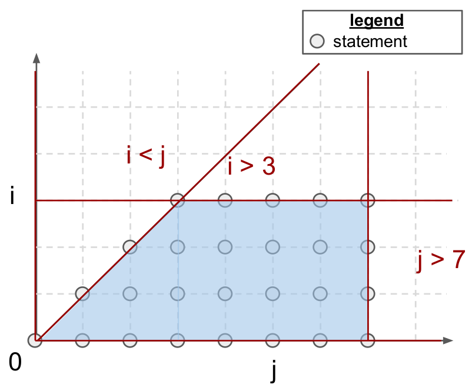
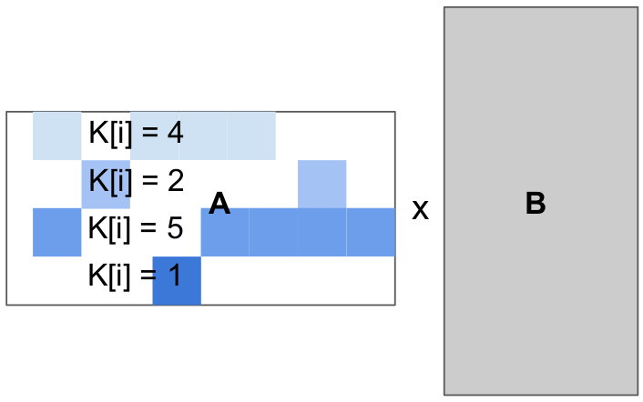

============
相关工作
============

乍看之下，Triton 似乎只是又一种面向 DNN 的 DSL。本节旨在为 Triton 提供背景定位，并阐明它与该领域两种主流方法——多面体编译和调度语言——的区别。

----------------------
多面体编译
----------------------

传统编译器通常依赖 LLVM-IR [LATTNER2004]_ 等中间表示，使用（非）条件分支来编码控制流信息。这种相对底层的格式使得静态分析输入程序的运行时行为（如缓存缺失）较为困难，也难以通过分块 [WOLFE1989]_、融合 [DARTE1999]_ 和交换 [ALLEN1984]_ 等手段自动优化循环。为解决这一问题，多面体编译器 [ANCOURT1991]_ 采用具有静态可预测控制流的程序表示，从而能够在编译期对程序进行激进的变换，以提升数据局部性和并行性。尽管这一策略已被许多 DNN 语言和编译器所采用，如 Tiramisu [BAGHDADI2021]_、Tensor Comprehensions [VASILACHE2018]_、Diesel [ELANGO2018]_ 以及 MLIR [LATTNER2019]_ 中的 Affine 方言，它也带来了若干限制，将在本节后续部分描述。

++++++++++++++++++++++
程序表示
++++++++++++++++++++++

多面体编译是一个庞大的研究领域。本节仅概述该主题最基础的内容，感兴趣的读者可参阅线性规划和整数规划领域的大量相关文献，深入了解其坚实的数学基础。

.. table::
    :widths: 50 50

    +-----------------------------------------------------+-----------------------------------------------------+
    |                                                     |                                                     |
    |.. code-block:: C                                    | |pic1|                                              |
    |                                                     |                                                     |
    |   for(int i = 0; i < 3; i++)                        |                                                     |
    |   for(int j = i; j < 5; j++)                        |                                                     |
    |     A[i][j] = 0;                                    |                                                     |
    +-----------------------------------------------------+-----------------------------------------------------+

多面体编译器专注于一类通常被称为**静态控制部分**（Static Control Parts，SCoP）的程序，即程序中若干连续语句的最大集合，其中条件和循环边界均为外层循环索引和全局不变参数的仿射函数。如上所示，这种格式的程序其迭代域总是由仿射不等式所界定，即多面体形式。这些多面体也可用代数方式定义；对于上述示例：

.. math::

  \mathcal{P} = \{ i, j \in \mathbb{Z}^2
  ~|~
  \begin{pmatrix}
  1 & 0 \\
  -1 & 0 \\
  -1 & 1 \\
  0 & -1 \\
  \end{pmatrix}
  \begin{pmatrix}
  i \\
  j
  \end{pmatrix}
  +
  \begin{pmatrix}
  0 \\
  2 \\
  0 \\
  4
  \end{pmatrix}
  \geq
  0
  \}

:math:`\mathcal{P}` 中的每个点 :math:`(i, j)` 表示一条*多面体语句*，即（1）不引发控制流副作用（如 :code:`for`、:code:`if`、:code:`break`），且（2）数组访问中仅包含循环索引和全局参数的仿射函数的程序语句。为便于别名分析，数组访问也被数学化抽象，使用所谓的*访问函数*表示。换言之，:code:`A[i][j]` 即 :code:`A[f(i,j)]`，其中访问函数 :math:`f` 定义为：

.. math::

  f(i, j) = \begin{pmatrix}
  1 & 0\\
  0 & 1\\
  \end{pmatrix}
  \begin{pmatrix}
  i\\
  j
  \end{pmatrix}
  =
  (i, j)

注意，SCoP 的迭代域并不规定其语句的执行顺序。事实上，这一迭代域可以按许多不同的合法顺序遍历，即*调度*（schedule）。形式上，调度定义为循环索引 :math:`\mathbf{x}` 和全局不变参数 :math:`\mathbf{g}` 的 p 维仿射变换 :math:`\Theta`：

.. math::
  \Theta_S(\mathbf{x}) = T_S \begin{pmatrix}
  \vec{x}\\
  \vec{g}\\
  1
  \end{pmatrix}
  \qquad
  T_S \in \mathbb{Z} ^{p \times (\text{dim}(\mathbf{x}) + \text{dim}(\mathbf{g}) + 1)}

其中 :math:`\Theta_S(\mathbf{x})` 是一个 p 维向量，表示遍历包围 :math:`S` 的循环嵌套时从最慢增长到最快增长的索引（从左到右）。对于上述代码，C 语言循环嵌套所定义的原始调度可通过以下方式得到：

.. math::
  \Theta_S(\mathbf{x}) = \begin{pmatrix}
  1 & 0 \\
  0 & 1 \\
  \end{pmatrix}
  \begin{pmatrix}
  i & j
  \end{pmatrix}^T
  =
  \begin{pmatrix}
  i & j
  \end{pmatrix}^T

其中 :math:`i` 和 :math:`j` 分别是循环嵌套中增长最慢和最快的循环索引。若 :math:`T_S` 为向量（resp. 张量），则 :math:`\Theta_S` 称为一维（resp. 多维）调度。

++++++++++
优势
++++++++++

适合多面体编译的程序可以进行激进的变换和优化。这些变换大多归结为生成能够支持循环变换的调度和迭代域，以提升并行性及空间/时间数据局部性（如融合、交换、分块、并行化）。

多面体编译器还能自动完成复杂的验证过程，确保输入程序的语义在整个优化阶段得以保持。值得注意的是，多面体优化器与更传统的优化技术并不冲突。实际上，这些系统通常以一组 LLVM passes 的形式实现，可在更传统的编译技术之前运行 [GROSSER2012]_。

总体而言，多面体机制在适用时极为强大。已有研究证明它支持大多数常见的循环变换，并在稠密矩阵乘法上达到了与最先进 GPU 库相当的性能 [ELANGO2018]_。此外，它完全自动化，除 C 风格源代码外不需要程序员提供任何额外提示。

+++++++++++
局限性
+++++++++++

不幸的是，多面体编译器存在两个主要限制，阻碍了它在神经网络代码生成中被广泛采用。

首先，可能的程序变换集合 :math:`\Omega = \{ \Theta_S ~|~ S \in \text{program} \}` 规模庞大，随程序中语句数量及其迭代域大小的增加而增长。验证每种变换的合法性也可能需要求解复杂的整数线性规划问题，使多面体编译计算开销极大。更糟糕的是，该框架还需要考虑硬件属性（如缓存大小、SM 数量）和上下文特征（如输入张量形状），导致昂贵的自动调优过程 [SATO2019]_。

其次，多面体框架的适用范围不够广泛；SCoP 虽然较为常见 [GIRBAL2006]_，但要求循环边界和数组下标为循环索引的仿射函数，这通常只出现在规则的稠密计算中。因此，该框架至今仍未能成功应用于稀疏或结构化稀疏神经网络——而这类网络的重要性在过去几年中正在迅速提升。

相比之下，本文所倡导的块程序表示适用范围更广，能够通过标准数据流分析实现接近峰值的性能。

--------------------
调度语言
--------------------

关注点分离 [DIJKSTRA82]_ 是计算机科学中一个广为人知的设计原则：程序应被分解为模块化的抽象层，将算法语义与实现细节相分离。Halide 和 TVM 等系统将这一理念更进一步，通过**调度语言**在语法层面强制实现这种分离。这一方法的优势在矩阵乘法的例子中尤为明显——算法定义（第 1-7 行）与实现（第 8-16 行）完全独立，两者可以分别维护、优化和分发。

.. code-block:: python
  :linenos:

  // 算法
  Var x("x"), y("y");
  Func matmul("matmul");
  RDom k(0, matrix_size);
  RVar ki;
  matmul(x, y) = 0.0f;
  matmul(x, y) += A(k, y) * B(x, k);
  // 调度
  Var xi("xi"), xo("xo"), yo("yo"), yi("yo"), yii("yii"), xii("xii");
  matmul.vectorize(x, 8);
  matmul.update(0)
      .split(x, x, xi, block_size).split(xi, xi, xii, 8)
      .split(y, y, yi, block_size).split(yi, yi, yii, 4)
      .split(k, k, ki, block_size)
      .reorder(xii, yii, xi, ki, yi, k, x, y)
      .parallel(y).vectorize(xii).unroll(xi).unroll(yii);

然而，生成的代码可能不完全可移植，因为调度有时依赖于不广泛支持的执行模型（如 SPMD）或硬件内在指令（如矩阵乘累加）。自动调度机制 [MULLAPUDI2016]_ 可以缓解这一问题。

++++++++++
优势
++++++++++

这种方法的主要优势在于：程序员只需编写一次算法，即可专注于性能优化。它支持手动指定静态数据流分析无法自动推断的优化。

调度语言无疑是神经网络代码生成中最流行的方法之一。其中最受欢迎的系统是 TVM，它在众多平台上都能提供良好的性能，并内置自动调度机制。

+++++++++++
局限性
+++++++++++

这种易用性是有代价的。首先，遵循这一范式的现有系统在适用的现代硬件上（如 V100/A100 tensor core，相同分块大小）往往明显慢于 Triton。我认为这并非调度语言的根本性问题——理论上可以通过更多努力来解决——但这可能意味着这类系统更难以工程化。更重要的是，现有调度语言生成的循环，其边界和增量不能依赖外层循环索引，否则至少会对可能的调度施加严重约束，甚至导致系统完全崩溃。这对于迭代空间不规则的稀疏计算来说是个大问题。

.. table::
    :widths: 50 50

    +-----------------------------------------------------+-----------------------------------------------------+
    |                                                     |                                                     |
    |.. code-block:: C                                    | |pic2|                                              |
    |                                                     |                                                     |
    |   for(int i = 0; i < 4; i++)                        |                                                     |
    |   for(int j = 0; j < 4; j++)                        |                                                     |
    |     float acc = 0;                                  |                                                     |
    |     for(int k = 0; k < K[i]; k++)                   |                                                     |
    |       acc += A[i][col[i, k]] * B[k][j]              |                                                     |
    |     C[i][j] = acc;                                  |                                                     |
    +-----------------------------------------------------+-----------------------------------------------------+

相比之下，我们在本工作中所倡导的块程序表示允许块结构化的迭代空间，程序员可以按自己的意愿手动处理负载均衡。

----------
参考文献
----------

.. [LATTNER2004] C. Lattner et al., "LLVM: a compilation framework for lifelong program analysis transformation", CGO 2004
.. [WOLFE1989] M. Wolfe, "More Iteration Space Tiling", SC 1989
.. [DARTE1999] A. Darte, "On the Complexity of Loop Fusion", PACT 1999
.. [ALLEN1984] J. Allen et al., "Automatic Loop Interchange", SIGPLAN Notices 1984
.. [ANCOURT1991] C. Ancourt et al., "Scanning Polyhedra with DO Loops", PPoPP 1991
.. [BAGHDADI2021] R. Baghdadi et al., "Tiramisu: A Polyhedral Compiler for Expressing Fast and Portable Code", CGO 2021
.. [VASILACHE2018] N. Vasilache et al., "Tensor Comprehensions: Framework-Agnostic High-Performance Machine Learning Abstractions", ArXiV 2018
.. [ELANGO2018] V. Elango et al. "Diesel: DSL for Linear Algebra and Neural Net Computations on GPUs", MAPL 2018
.. [LATTNER2019] C. Lattner et al., "MLIR Primer: A Compiler Infrastructure for the End of Moore's Law", Arxiv 2019
.. [GROSSER2012] T. Grosser et al., "Polly - Performing Polyhedral Optimizations on a Low-Level Intermediate Representation", Parallel Processing Letters 2012
.. [SATO2019] Y. Sato et al., "An Autotuning Framework for Scalable Execution of Tiled Code via Iterative Polyhedral Compilation", TACO 2019
.. [GIRBAL2006] S. Girbal et al., "Semi-Automatic Composition of Loop Transformations for Deep Parallelism and Memory Hierarchies", International Journal of Parallel Programming 2006
.. [DIJKSTRA82] E. W. Dijkstra et al., "On the role of scientific thought", Selected writings on computing: a personal perspective 1982
.. [MULLAPUDI2016] R. Mullapudi et al., "Automatically scheduling halide image processing pipelines", TOG 2016
